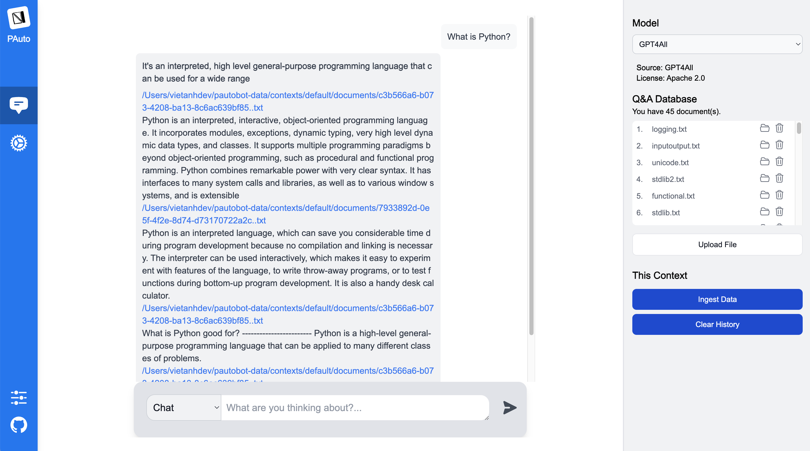

<p align="center">
  
  <h1 align="center">🔥 PⒶutoBot 🔥</h1>
  <p align="center" style="font-size:18px"><b>Private AutoGPT Robot</b> - Your private task assistant with GPT!</p>
</p>

- 🔥 **Chat** to your offline **LLMs on CPU Only**. **100% private**, no data leaves your execution environment at any point.
- 🔥 **Ask questions** to your documents without an internet connection. Engine developed based on [PrivateGPT](https://github.com/imartinez/privateGPT).
- 🔥 **Automate tasks** easily with **PAutoBot plugins**. Easy for everyone.
- 🔥 **Easy coding structure** with **Next.js** and **Python**. Easy to understand and modify.
- 🔥 **Built with** [LangChain](https://github.com/hwchase17/langchain), [GPT4All](https://github.com/nomic-ai/gpt4all), [LlamaCpp](https://github.com/ggerganov/llama.cpp), [Chroma](https://www.trychroma.com/), [SentenceTransformers](https://www.sbert.net/), [PrivateGPT](https://github.com/imartinez/privateGPT).



**The supported extensions are:**

- `.csv`: CSV,
- `.docx`: Word Document,
- `.doc`: Word Document,
- `.enex`: EverNote,
- `.eml`: Email,
- `.epub`: EPub,
- `.html`: HTML File,
- `.md`: Markdown,
- `.msg`: Outlook Message,
- `.odt`: Open Document Text,
- `.pdf`: Portable Document Format (PDF),
- `.pptx` : PowerPoint Document,
- `.ppt` : PowerPoint Document,
- `.txt`: Text file (UTF-8),

## I. Installation and Usage

### 1. Installation

- Python 3.8 or higher.
- Install **PAutoBot**:

```shell
pip install pautobot
```

#### For Windows 10/11

To install a C++ compiler on Windows 10/11, follow these steps:

1. Install Visual Studio 2022.
2. Make sure the following components are selected:
   - Universal Windows Platform development
   - C++ CMake tools for Windows
3. Download the MinGW installer from the [MinGW website](https://sourceforge.net/projects/mingw/).
4. Run the installer and select the `gcc` component.

#### Mac Running Intel

When running a Mac with Intel hardware (not M1), you may run into _clang: error: the clang compiler does not support '-march=native'_ during pip install.

If so set your archflags during pip install. eg: _ARCHFLAGS="-arch x86_64" pip3 install -r requirements.txt_

### 2. Usage

- Run the app:

```shell
python -m pautobot.app
```

or just:

```shell
pautobot
```

- Go to <http://localhost:5678/> to see the user interface. You can choose one of the two modes:
  - **Chat**
  - **Chat + QA**
- Upload some documents to the app (see the supported extensions above). You can try [docs/python3.11.3_lite.zip](docs/python3.11.3_lite.zip) for a quick start. This zip file contains 45 files from the [Python 3.11.3 documentation](https://docs.python.org/3/download.html).
- Ingest documents with **Ingest Data** button.

## II. Development

### 1. Clone the source code

```shell
git clone https://github.com/nrl-ai/pautobot
cd pautobot
```

### 2. Run your backend

- Python 3.8 or higher.
- To install Pautobot from source, from `pautobot` source code directory, run:

```shell
pip install -e .
```

- Run the app:

```shell
python -m pautobot.app
```

- Go to <http://localhost:5678/> to see the user interface.

### 2. Run your frontend

- Install the dependencies:

```shell
cd frontend
npm install
```

- Run the app:

```shell
npm run dev
```

- Go to <http://localhost:3000/> to see the user interface. Use this address to develop the frontend.
